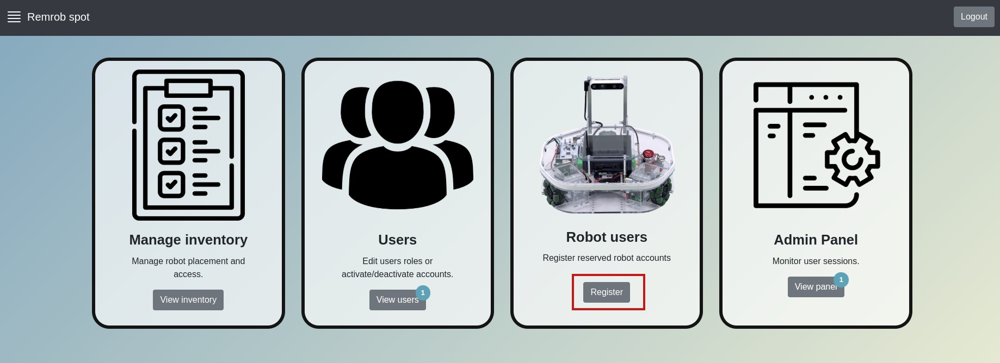
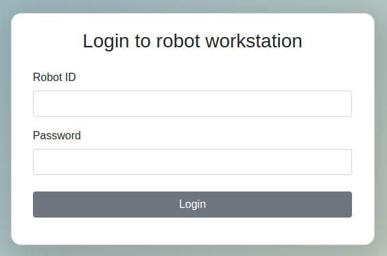
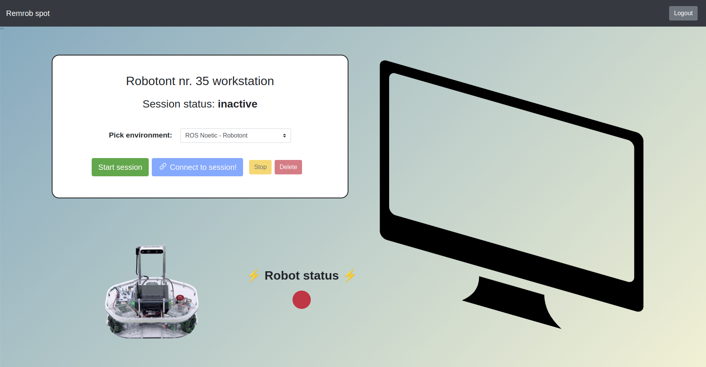

# Remrob Spot - bootstrapping ROS workshops

This is a remrob app version meant to be run locally and removes the time booking part of the webapp.

Instead of having user accounts, there are robot accounts - via the robot user login it is possible to immediately gain access to a robot session panel with no time cap.

The only user able to create robot accounts is the reserved user "admin", if no such user is available then insert it into the database manually.

## Running Remrob Spot

### remrob-server
The `remrob-server` backend needs to be enabled in Remrob Spot mode, which can be done by setting the configuration entry `LocalRemrob` to `true` in config/default.json and restarting that service (if running with pm2, then the restart can be done with: `pm2 restart remrob`).

### remrob-webapp

For frontend the steps are (assuming system was setup via [remrob-setup](https://github.com/unitartu-remrob/remrob-setup)):
1) Checkout this branch
2) Restart the flask backend:
    `systemctl restart remrob-flask.service`
3) Rebuild the frontend app
    `npm run build`

## Creating robot accounts

Login as the reserved "admin" user and navigate to robot registration from the admin menu:

The robot account name must match the pattern `$robot_name`-`$id`.

**!NB: Make sure the corresponding robots are also get registered under 'Inventory'**

After both the robot user has been created and the robot has been entered into the inventory, you can attempt to login as the robot user.

Upon successful login you should be directly navigated to the specific robot session panel.

### Adding different robots

The robots which will be accepted by [remrob-server](https://github.com/unitartu-remrob/remrob-server) container backend are listed in that service under `RobotsAvailable` config entry in config/default.json.

To enable other robots for Remrob Spot, besides all the [regular steps](https://github.com/unitartu-remrob/remrob-setup/tree/main/robots) you must also supplement the `RobotsAvailable` list with robot names you have registered (`$robot_name` in the robot account name, e.g. "robotont").